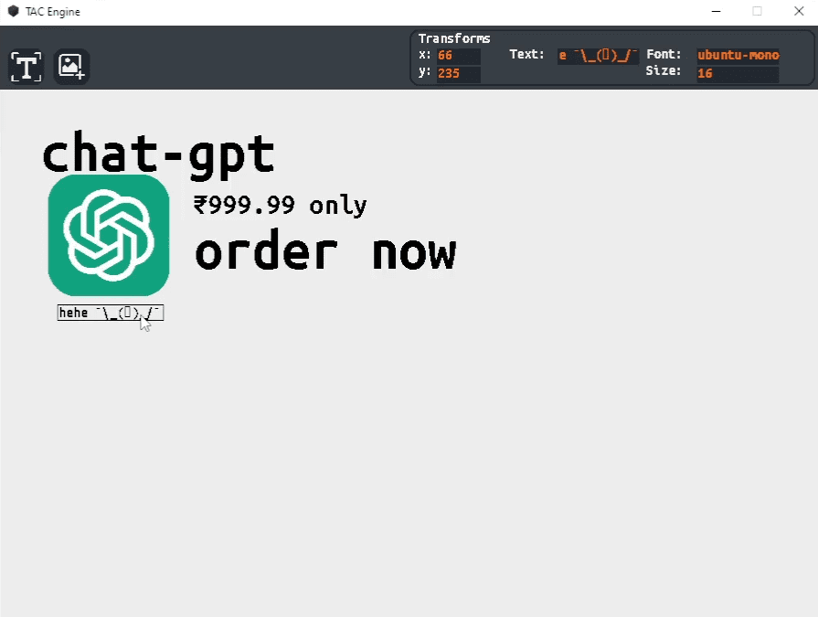
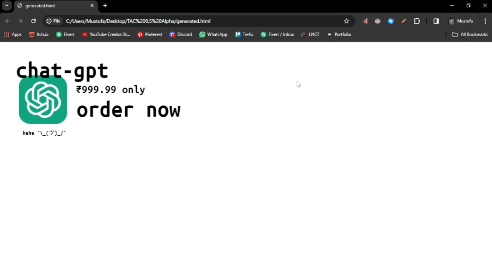
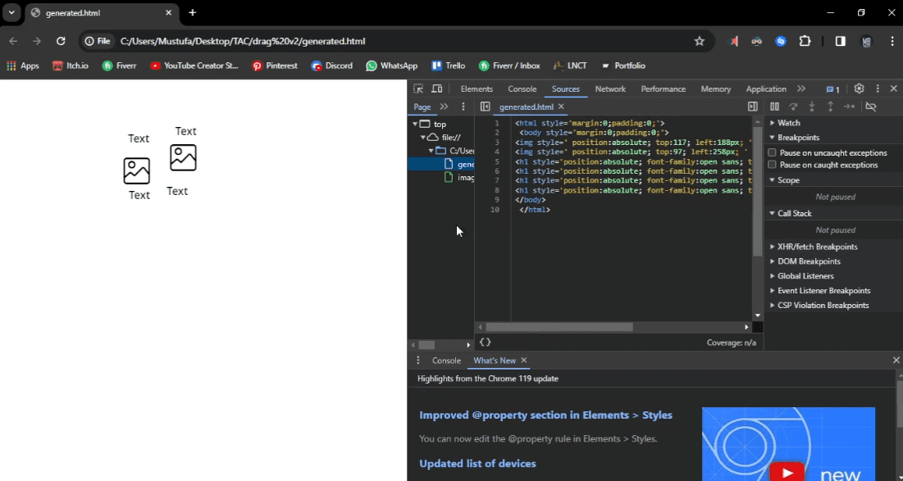
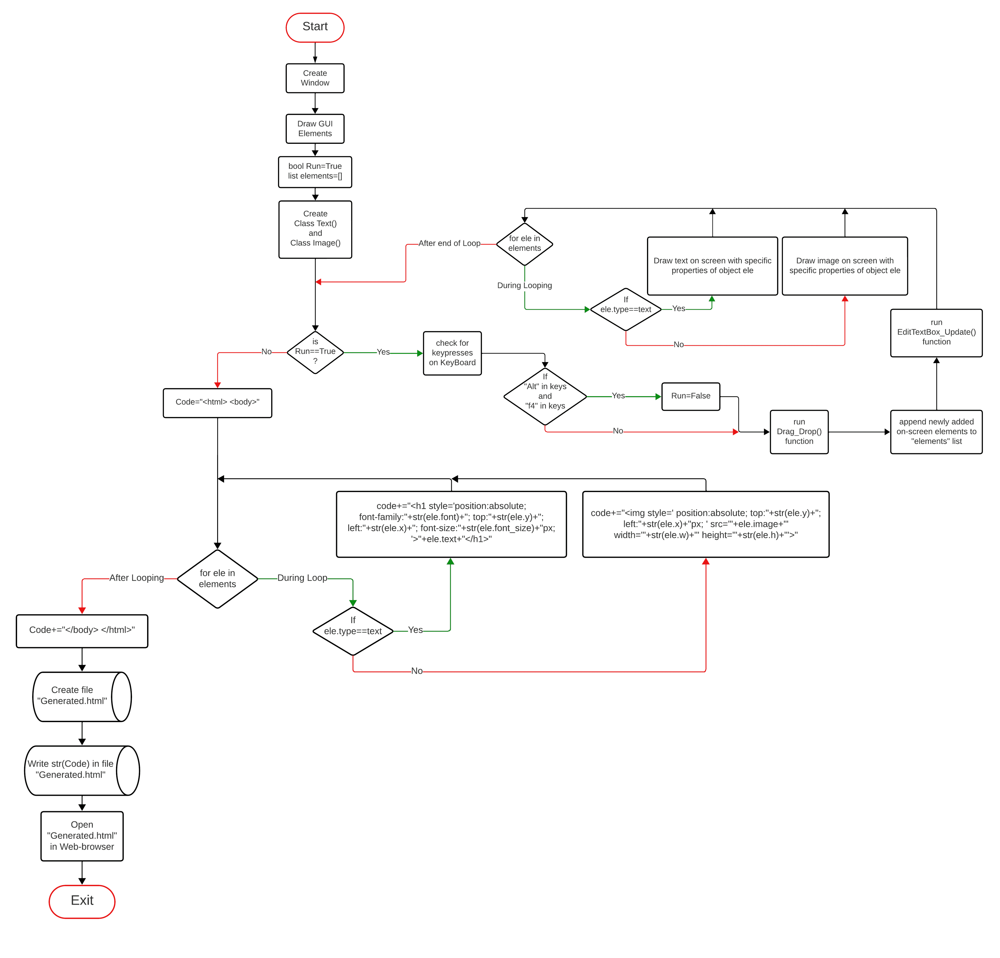

# TAC-Engine
  A WYSIWYG editor for creating webpages without writing a single line of code.

## Installation

You only need to install 3 modules for this.

1. Clipboard is a cross platform clipboard operation library of Python. Works for Windows, Mac and Linux.
   ```
   pip install clipboard
   ```
2. Pygame is a cross-platform set of Python modules designed for writing video games.
   ```
   pip install pygame
   ```

3. PyAutoGUI lets your Python scripts control the mouse and keyboard to automate interactions with other applications.
   ```
   pip install pyautogui
   ```
  
  
  
  
  
